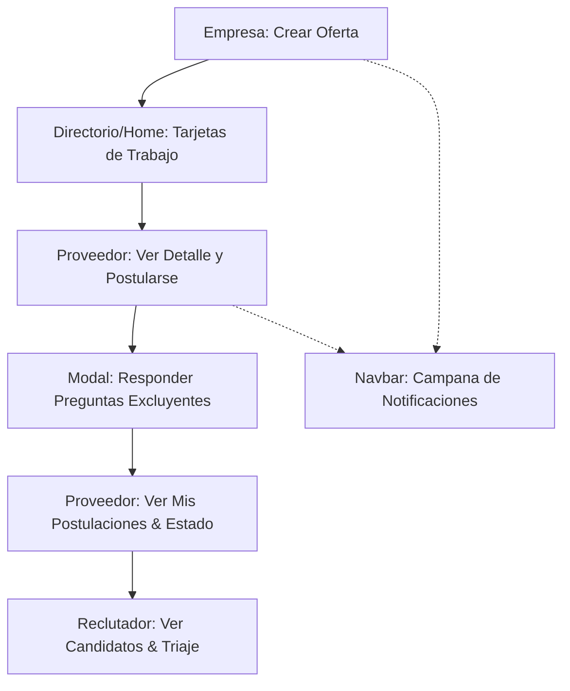

# Roadmap de Implementación Frontend: Bolsa de Empleo (Fase 2)

Este documento detalla la planificación y los prompts de generación de imágenes para los componentes frontend de la Bolsa de Empleo de Chamba.

---

## 📋 Resumen del Flujo de Trabajo



---

## 🚀 PASO 1: Creación de Oferta de Empleo
**Componente:** `CrearOfertaEmpresa.jsx`  
**Objetivo:** Permitir a las empresas publicar una oferta con preguntas de filtro excluyentes (Knockout Questions).

### 🎨 Prompt para la IA (Generador de Mockup Visual)
```xml
<contexto_del_sistema>
Plataforma Chamba. El branding utiliza un color morado de acento (#A01EED), tipografías Poppins e Inter, tarjetas con esquinas redondeadas (24px), bordes gris claro y estilo glassmorphism.
</contexto_del_sistema>

<imperativo_de_tarea>
Generar una imagen de mockup de alta fidelidad (UI/UX Mockup) de la interfaz de usuario para una pantalla de "Creación de Oferta de Empleo" (Recruiter Dashboard).
</imperativo_de_tarea>

<elementos_visuales_obligatorios>
1. FORMULARIO PRINCIPAL:
   - Título de sección: "Publicar Oferta de Empleo".
   - Inputs para: Título del Puesto, Descripción de la Obra (textarea), Modalidad (Dropdown con Presencial seleccionado).
   - Rango Salarial: Inputs para Mínimo y Máximo, con checkbox a la derecha "A convenir".
   - Campo "Habilidades Clave" mostrando chips morados (#A01EED) con botón de eliminar.
2. PREGUNTAS DE FILTRO EXCLUYENTES:
   - Fila de pregunta 1: "¿Disponés de herramientas de termofusión propias?" con un switch en posición SI.
   - Fila de pregunta 2: "¿Tenés matrícula de gasista activa?" con un switch en posición NO.
   - Botón morado claro de "+ Agregar pregunta filtro".
3. BOTONES Y ACCIONES:
   - Botón principal en el pie: "Publicar Oferta Laboral ✓" en morado sólido (#A01EED).
</elementos_visuales_obligatorios>

<estilo_y_direccion_de_arte>
Diseño plano y minimalista (flat vector web design). Tarjeta central con sombra suave sobre fondo gris claro neutro. Sin manos, sin personas, sin laptops ni teléfonos alrededor (no device frame). Captura limpia de interfaz web para escritorio, 8k.
</estilo_y_direccion_de_arte>
```

---

## 🚀 PASO 2: Buscador Hero de Empleo
**Componente:** `BuscadorHeroTrabajo.jsx`  
**Objetivo:** Permitir al usuario buscar ofertas directamente desde la Home, promoviendo eficiencia y neutralidad. Redirige al directorio con parámetros de búsqueda.

### 🎨 Prompt para la IA (Generador de Mockup Visual)
```xml
<contexto_del_sistema>
Plataforma Chamba. El branding utiliza un color morado de acento (#A01EED), tipografías Poppins e Inter, tarjetas con esquinas redondeadas (24px), bordes gris claro y estilo glassmorphism.
</contexto_del_sistema>

<imperativo_de_tarea>
Generar una imagen de mockup de alta fidelidad (UI/UX Mockup) de la interfaz de usuario para un "Buscador Hero de Empleo" (Job Search Hero Section) para la pantalla principal de Chamba.
</imperativo_de_tarea>

<elementos_visuales_obligatorios>
1. CONTENEDOR HERO:
   - Tarjeta central grande con estilo glassmorphism (fondo blanco translúcido, bordes redondeados suaves de 24px, sombra difuminada y sutil).
2. TÍTULO Y DESCRIPCIÓN:
   - Título en tipografía Poppins negrita: "Encontrá tu próximo trabajo"
   - Subtítulo en gris oscuro: "Explorá cientos de ofertas de empleo locales y remotas en un solo lugar."
3. BARRA DE BÚSQUEDA INTEGRADA (Fila horizontal de inputs):
   - Input 1 (Izquierda): Icono de lupa, texto placeholder: "Puesto, habilidad o rubro... (ej: Gasista)".
   - Divisor vertical sutil.
   - Input 2 (Centro): Icono de mapa/ubicación, texto placeholder: "Ciudad o 'Remoto'...".
   - Botón de Acción (Derecha): Botón morado sólido (#A01EED) con texto blanco "Buscar empleo ✓".
4. ETIQUETAS DE BÚSQUEDAS POPULARES:
   - Una fila de chips clickables debajo de la barra de búsqueda con la leyenda "Búsquedas populares:" seguida de chips redondeados grises con iconos sutiles:
     - "💻 Remoto"
     - "🔧 Plomería"
     - "⚡ Electricidad"
     - "🔨 Construcción"
</elementos_visuales_obligatorios>

<estilo_y_direccion_de_arte>
Diseño plano y minimalista (flat vector web design). Captura de pantalla limpia de interfaz web para escritorio, sin laptops, manos ni teléfonos alrededor (no device frame). Resolución 8k, fondo gris claro neutro.
</estilo_y_direccion_de_arte>
```

---

## 🚀 PASO 3: Directorio General de Empleo
**Componente:** `DirectorioOfertasTrabajo.jsx`  
**Objetivo:** Buscador de ofertas de empleo con filtros y paginación.

### 🎨 Prompt para la IA (Generador de Mockup Visual)
```xml
<contexto_del_sistema>
Plataforma Chamba. Color principal morado (#A01EED), tipografía Inter y bordes redondeados minimalistas.
</contexto_del_sistema>

<imperativo_de_tarea>
Generar una imagen de mockup (UI/UX Mockup) de la interfaz de un buscador y directorio de ofertas de empleo activas.
</imperativo_del_sistema>

<elementos_visuales_obligatorios>
1. BARRA DE BÚSQUEDA SUPERIOR:
   - Campo de texto con icono de lupa, placeholder "Buscar ofertas de empleo..." y botón "Buscar" en color morado (#A01EED).
2. PANEL DE FILTROS LATERAL (IZQUIERDA):
   - Filtro por rubro con checkboxes.
   - Filtro por modalidad con chips clickables (Presencial, Remoto, Híbrido).
   - Filtro de salario con campos numéricos Mínimo y Máximo.
3. LISTA DE RESULTADOS (DERECHA) Y PAGINACIÓN:
   - Lista vertical de tarjetas de trabajo (estilo paso 2).
   - Barra de paginación inferior interactiva con números de página ("Anterior", "1", "2", "Siguiente").
</elementos_visuales_obligatorios>

<estilo_y_direccion_de_arte>
Captura de pantalla de la interfaz de escritorio completa. Fondo blanco y grises claros. Sombra suave, diseño plano sin marcos de dispositivos. Resolución 8k.
</estilo_y_direccion_de_arte>
```

---

## 🚀 PASO 4: Modal de Postulación con Triaje
**Componente:** `ModalPostularse.jsx`  
**Objetivo:** Popup para responder preguntas de filtro y subir currículum.

### 🎨 Prompt para la IA (Generador de Mockup Visual)
```xml
<contexto_del_sistema>
Plataforma Chamba. Color de marca morado (#A01EED), fondo desenfocado y estilo limpio.
</contexto_del_sistema>

<imperativo_de_tarea>
Generar una imagen de mockup (UI/UX Mockup) de una ventana modal emergente para postularse a una oferta laboral.
</imperativo_de_tarea>

<elementos_visuales_obligatorios>
1. ENCABEZADO:
   - Título del puesto y nombre de la empresa en negrita.
2. FORMULARIO INTERNO:
   - Textarea opcional para un mensaje de presentación.
   - Checkbox "Usar mi Currículum Nativo de Chamba" (marcado) y un área para arrastrar y soltar un "CV en PDF" como alternativa.
3. SECCIÓN DE PREGUNTAS FILTRO (OBLIGATORIAS):
   - Contenedor con fondo amarillo muy claro.
   - Dos preguntas con botones binarios ("SI" y "NO") destacados para responder.
4. BOTONES DEL PIE:
   - Botón izquierdo: "Cancelar" (texto gris).
   - Botón derecho: "Enviar Postulación ✓" (morado sólido #A01EED).
</elementos_visuales_obligatorios>

<estilo_y_direccion_de_arte>
Modal flotante sobre fondo oscuro desenfocado (backdrop blur). Diseño de interfaz plano para escritorio. Sin laptops ni manos en la imagen. Resolución 8k.
</estilo_y_direccion_de_arte>
```

---

## 🚀 PASO 5: Panel de Mis Postulaciones
**Componente:** `MisPostulacionesProveedor.jsx`  
**Objetivo:** Pestaña de seguimiento de candidaturas y visualización de descarte.

### 🎨 Prompt para la IA (Generador de Mockup Visual)
```xml
<contexto_del_sistema>
Plataforma Chamba. Color principal morado (#A01EED), tipografía Inter y bordes redondeados limpios.
</contexto_del_sistema>

<imperativo_de_tarea>
Generar una imagen de mockup (UI/UX Mockup) del panel de usuario "Mis Postulaciones" para un candidato.
</imperativo_de_tarea>

<elementos_visuales_obligatorios>
1. TABLA DE POSTULACIONES:
   - Columnas: Oferta, Empresa, Fecha, Estado.
   - Los estados se muestran en badges de colores: "En Revisión" (morado claro), "Contactado" (verde claro), y "Descartado" (rojo claro).
2. SECCIÓN DE FEEDBACK EXPANDIDA (DESCARTE):
   - Debajo de la postulación "Descartado", se muestra una caja de alerta roja clara expandida.
   - Contenido visible: "Motivo: Falta de experiencia. Comentarios: Te sugerimos ganar experiencia en soldadura antes de postularte."
</elementos_visuales_obligatorios>

<estilo_y_direccion_de_arte>
Interfaz web de escritorio limpia y plana. Fondo blanco con bordes gris suave. Sin elementos decorativos tridimensionales ni dispositivos físicos. Resolución 8k.
</estilo_y_direccion_de_arte>
```

---

## 🚀 PASO 6: Campana de Notificaciones
**Componente:** `CampanaNotificaciones.jsx`  
**Objetivo:** Indicador del Navbar con contador y popover de notificaciones.

### 🎨 Prompt para la IA (Generador de Mockup Visual)
```xml
<contexto_del_sistema>
Plataforma Chamba. Color de acento morado (#A01EED), sombras muy suaves, bordes curvados y efecto de desenfoque de cristal.
</contexto_del_sistema>

<imperativo_de_tarea>
Generar una imagen de mockup (UI/UX Mockup) en primer plano que muestre la campana de notificaciones abierta en la barra de navegación.
</imperativo_de_tarea>

<elementos_visuales_obligatorios>
1. INDICADOR NAVBAR:
   - Icono de campana con un círculo indicador rojo y número "3" flotando en la esquina superior.
2. PANEL DESPLEGABLE (POPOVER):
   - Cabecera: Título "Notificaciones" y enlace "Marcar todo como leído" en morado.
   - Lista de 3 notificaciones:
     - Notificación 1 (No leída): Fondo morado muy sutil, punto indicador morado a la izquierda. Texto: "Tu postulación para Plomero fue vista".
     - Notificaciones leídas: Fondo blanco con texto gris e iconos descriptivos sencillos.
   - Pie: Enlace "Ver todas las notificaciones".
</elementos_visuales_obligatorios>

<estilo_y_direccion_de_arte>
Captura de pantalla en primer plano de la esquina superior derecha del header de un sitio web. Diseño plano minimalista con efecto de desenfoque. Resolución 8k.
</estilo_y_direccion_de_arte>
```

---

## 📅 Plan de Ejecución Sugerido

Se completó exitosamente el desarrollo en las 3 etapas planificadas:

| Etapa | Componentes Desarrollados | Objetivo | Estado |
| :--- | :--- | :--- | :--- |
| **Etapa A** | `CrearOfertaEmpresa.jsx` y `CampanaNotificaciones.jsx` | Permitir la publicación de trabajo y alertar a la barra de navegación. | **✓ Completado** |
| **Etapa B** | `BuscadorHeroTrabajo.jsx` y `ModalPostularse.jsx` | Habilitar la búsqueda hero en Home y la postulación con knockout questions. | **✓ Completado** |
| **Etapa C** | `DirectorioOfertasTrabajo.jsx` y `MisPostulacionesProveedor.jsx` | Completar el buscador avanzado de empleo y la autogestión de postulantes. | **✓ Completado** |

---

## 💡 Nota sobre el Rol de Proveedor como Ofertante

De acuerdo con el modelo de datos de la plataforma, tanto las **Empresas** como los **Proveedores** tienen permitido publicar ofertas de empleo. 
- La lógica de backend ya acepta `proveedorId` o `empresaId` (pero no ambos) en la publicación (`POST /api/v1/ofertas`).
- En la **Etapa A**, implementamos el flujo principal asumiendo el rol activo de Empresa.
- Tras completar las etapas B y C, se auditará y adaptará el flujo de navegación para que el **Proveedor** (cuando actúe como contratista/ofertante) también pueda acceder a su propio Panel Reclutador y crear ofertas con el mismo componente `CrearOfertaEmpresa.jsx`, ya que este componente detecta automáticamente el tipo de perfil activo (`EMPRESA` o `PROVEEDOR`) a través de `useIdentityStore.js`.
