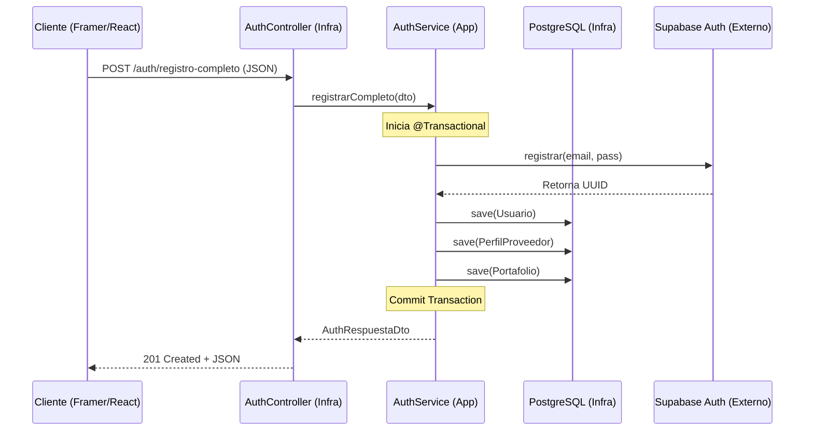

# 🎓 Presentación Examen Final: CHAMBA (Marketplace de Servicios)

## 🗣️ Introducción (El "Elevator Pitch")
**Lo que van a decir:**  
> "Hola profesor/a. Hoy presentamos **CHAMBA**, nuestro marketplace de servicios. Nuestro enfoque no fue solo hacer que 'funcione', sino construir un backend con calidad de producción, escalable y seguro. Vamos a mostrarles cómo cumplimos con las operaciones CRUD, cómo estructuramos la API REST y las decisiones técnicas que tomamos para lograrlo."

---

## 🧱 Bloque 1: Arquitectura Limpia (Cómo organizamos la casa)
**El concepto:** Explicar que no metieron todo el código en una sola carpeta, sino que usaron **Clean Architecture** (Arquitectura Hexagonal). Esto permite que el sistema sea fácil de mantener, testear y escalar.

### 📂 Nuestra Estructura de Carpetas
"Dividimos el proyecto en capas bien definidas para separar las responsabilidades técnicas de las reglas de negocio:"

1.  **`domain` (EL NÚCLEO):**
    *   Es la capa más importante y **pura**. No depende de ningún framework (ni Spring, ni JPA).
    *   **`model`:** Contiene nuestras entidades de negocio (POJOs) como `Proveedor` o `Servicio`.
    *   **`repository`:** Define las **interfaces** (puertos) de cómo queremos que se guarden los datos, sin decir qué base de datos usamos.
2.  **`application` (CASOS DE USO):**
    *   Es el director de orquesta. Aquí vive la lógica de "qué debe pasar".
    *   **`usecase`:** Interfaces que definen las acciones del sistema (ej: `IRegistrarProveedor`).
    *   **`service`:** Implementaciones que coordinan el flujo: llaman al dominio, validan y persisten.
    *   **`dto`:** Objetos de transferencia para que el cliente no vea nuestras entidades internas (separados en `request` y `response`).
3.  **`infrastructure` (ADAPTADORES):**
    *   Es la capa técnica que habla con el mundo exterior.
    *   **`adapter/in/web`:** Aquí están nuestros **Controllers**. Reciben el HTTP y lo pasan a la capa de aplicación.
    *   **`adapter/out/persistence`:** Aquí vive la base de datos real (JPA, Entidades de tabla, Repositorios de Spring Data).
    *   **`adapter/out/api`:** Clientes para servicios externos como **Supabase** (Auth) o **Cloudinary** (Fotos).
4.  **`common`:**
    *   Utilidades transversales y herramientas que usamos en todo el proyecto (como mapeadores o constantes globales).

> **Punto clave para destacar:** "Si mañana decidimos cambiar la base de datos de PostgreSQL a MongoDB, solo tenemos que tocar la carpeta `infrastructure`. El corazón del negocio (`domain`) y cómo funcionan los procesos (`application`) se mantienen intactos."

---

## 🔄 Bloque 2: La API REST y el CRUD (Ejemplos Reales)
**El concepto:** Demostrar que tenemos una API madura que sigue los estándares de la industria.

### 🆕 C (Create): Registro de Intenciones de Contacto
Para la creación, usamos `@PostMapping` y nos aseguramos de devolver el estado `201 Created`. Un ejemplo clave es cuando un cliente quiere contactar a un profesional:

```java
@PostMapping
public ResponseEntity<ContactoRespuestaDto> registrarContacto(
        @RequestHeader("X-User-Id") UUID interesadoId,
        @Valid @RequestBody ContactoSolicitudDto dto,
        HttpServletRequest request) {
    
    String ip = request.getRemoteAddr(); // Capturamos la IP para auditoría
    return ResponseEntity.status(HttpStatus.CREATED)
            .body(intencionContactoService.registrarContacto(interesadoId, dto.getDestinoId(), ip));
}
```
**Explicación técnica:**
*   **Validación:** Usamos `@Valid` para que Spring valide automáticamente el DTO antes de entrar al método.
*   **Seguridad:** El `interesadoId` viene de un Header, lo que garantiza que solo usuarios autenticados puedan generar leads.
*   **Semántica HTTP:** No devolvemos un simple 200, devolvemos un **201**, indicando que un nuevo recurso (la intención de contacto) ha sido creado con éxito.

---

### 🔍 R (Read): Búsqueda por Slug (SEO Friendly)
En lugar de buscar solo por IDs numéricos o UUIDs (que son feos para el usuario), implementamos búsqueda por **Slug**:

```java
@GetMapping("/proveedor/slug/{slug}")
public ResponseEntity<PerfilDetalleDto> obtenerDetallePorSlug(
        @PathVariable String slug,
        @RequestHeader(value = "X-User-Id", required = false) UUID requesterId) {
    return ResponseEntity.ok(consultarDetallePerfilUseCase.obtenerDetalleProveedorPorSlug(slug, requesterId));
}
```
**Explicación técnica:**
*   **SEO:** Esto permite que la URL sea `/proveedor/juan-perez-electricista`, lo cual mejora el posicionamiento en buscadores.
*   **Opcionalidad:** El `requesterId` es opcional, permitiendo que usuarios no logueados vean el perfil, pero personalizando la vista si el usuario está autenticado.

---

### 🆙 U (Update): Actualización de Perfil Profesional
Para las actualizaciones usamos `@PutMapping`. Aquí el "jugo" está en cómo manejamos los datos complejos:

```java
@PutMapping("/proveedor/me")
public ResponseEntity<Void> actualizarMiPerfilProfesional(
        @RequestHeader("X-User-Id") UUID usuarioId,
        @RequestBody PerfilSolicitudDto dto) {
    gestionarPerfilProfesionalUseCase.actualizarPerfilProveedor(usuarioId, dto);
    return ResponseEntity.ok().build();
}
```
**Explicación técnica:**
*   **Idempotencia:** El uso de `PUT` garantiza que si la petición se envía dos veces, el resultado final en la base de datos sea el mismo.
*   **Abstracción:** El controlador no sabe *cómo* se actualiza; delega la responsabilidad al **Caso de Uso**, manteniendo la arquitectura limpia.

---

### 🗑️ D (Delete): Borrado Lógico (Soft Delete)
En este proyecto, decidimos **no eliminar datos físicos** de la base de datos para preservar la integridad referencial y permitir auditorías. Usamos Hibernate para automatizarlo:

```java
@Entity
@Table(name = "usuarios")
@SQLDelete(sql = "UPDATE usuarios SET activo = false WHERE id = ?")
@SQLRestriction("activo = true")
public class Usuario {
    // ... campos ...
    @Column(nullable = false)
    private boolean activo = true;
}
```
**Explicación técnica:**
*   **@SQLDelete:** Sobreescribe el comando `DELETE` de SQL. Cuando llamamos a `repository.delete(usuario)`, Hibernate ejecuta un `UPDATE` automáticamente.
*   **@SQLRestriction:** Es un filtro global. Todas las consultas (`findAll`, `findById`) añadirán automáticamente un `WHERE activo = true`, por lo que los usuarios "borrados" desaparecen del sistema sin haber sido eliminados físicamente.

---

## 🛡️ Bloque 3: Seguridad y DTOs (Por qué no exponemos la base de datos)
**El concepto:** Explicar el uso de Data Transfer Objects.

**Cómo explicarlo fácil:**  
"Nuestras Entidades de base de datos nunca llegan al cliente. Usamos **DTOs** por tres motivos:
1.  **Seguridad:** No filtramos contraseñas ni IDs ocultos.
2.  **Rendimiento:** Evitamos errores de recursividad al transformar a JSON.
3.  **Contrato Estable:** Mantenemos un contrato fijo con el frontend independientemente de cómo cambie la DB."

> **Dato extra:** "Incluso separamos los DTOs en `request` (donde aplicamos las validaciones `@Valid`) y `response` (lo que sale limpio hacia el cliente)."

---

## 🧪 Bloque 4: Swagger y Pruebas (Requisito del Profesor)
**El concepto:** Mostrar la documentación interactiva.

**Cómo explicarlo fácil:**  
"Cumpliendo con los requisitos, integramos **Swagger (OpenAPI 3)**. Nuestra API está 100% documentada. Esto genera una interfaz gráfica donde pudimos realizar todas las pruebas de nuestras rutas, permitiendo incluso inyectar el token **JWT** para probar los endpoints protegidos directamente desde el navegador."

---

---

## 🔄 Bloque Extra: Ciclo de Vida de una Petición (El camino del Dato)
**El concepto:** Explicar cómo viaja la información desde que el usuario hace clic en el frontend hasta que se guarda en la nube y en nuestra base de datos.

### 🛤️ Ejemplo: Registro Completo de un Profesional
Este es el flujo más complejo y completo de nuestra plataforma, ya que involucra múltiples capas y servicios externos.



#### 1. Entrada (Capa de Infraestructura)
El cliente envía los datos del formulario. El `AuthController` actúa como puerta de entrada:
```java
@PostMapping("/registro-completo")
public ResponseEntity<AuthRespuestaDto> registrarCompleto(@Valid @RequestBody RegistroCompletoSolicitudDto solicitud) {
    // La anotación @Valid asegura que los datos lleguen limpios
    return ResponseEntity.status(HttpStatus.CREATED).body(authUseCase.registrarCompleto(solicitud));
}
```

#### 2. Orquestación y Conexión Externa (Capa de Aplicación)
El `AuthServiceImpl` coordina todo. Lo más interesante es la **Sincronización con Supabase**:
```java
@Transactional
public AuthRespuestaDto registrarCompleto(RegistroCompletoSolicitudDto dto) {
    // 1. Registro en Supabase (Externo)
    // Si Supabase falla, se lanza una excepción y nada se guarda localmente
    UUID supabaseId = supabaseAuthPort.registrar(dto.getEmail(), dto.getPassword());

    // 2. Persistencia en nuestra DB local (PostgreSQL)
    Usuario usuario = Usuario.builder().id(supabaseId)...build();
    usuarioRepository.save(usuario);
    
    // 3. Creación de perfil mediante Factory Pattern
    factory.crearYGuardarPerfil(usuario, rubro, puntoUbicacion, dto);
    
    return authRespuesta;
}
```

#### 3. El porqué de este diseño:
*   **Transaccionalidad:** Usamos `@Transactional` para que si falla el guardado en nuestra base de datos después de haber creado el usuario en Supabase (o viceversa), el sistema no quede en un estado inconsistente.
*   **Seguridad Delegada:** Al conectar con la API de Supabase, nosotros **nunca manejamos contraseñas en texto plano**. Solo guardamos el UUID que Supabase nos devuelve para linkear el perfil.
*   **Separación de Responsabilidades:** El controlador solo recibe, el servicio solo orquesta, y los adaptadores (Supabase/DB) solo ejecutan la persistencia.

---

## 🧠 Bloque 5: Decisiones Arquitectónicas (El "Por Qué")
*Este bloque demuestra que pensaron como verdaderos ingenieros de software.*

1.  **Sincronización Dual con Supabase:**  
    *   **Por qué:** En lugar de guardar contraseñas (riesgo de seguridad), delegamos la autenticación a Supabase. Guardamos el UUID localmente para mantener la integridad de los perfiles.
2.  **Columnas JSONB en PostgreSQL:**  
    *   **Por qué:** Para datos variables (redes sociales o especialidades), usamos esquemas **JSONB**. Nos da la flexibilidad de NoSQL con la robustez de SQL.
3.  **Carga de Archivos vs. Enlaces:**  
    *   **Por qué:** Las fotos se suben a **Cloudinary (CDN)** porque guardar imágenes en la DB arruina el rendimiento. Para videos, usamos enlaces externos para ahorrar costos y mejorar el **SEO**.
4.  **Slugs vs. UUIDs para el Frontend:**  
    *   **Por qué:** Reemplazamos URLs con IDs largos por **Slugs** (ej. `/proveedor/kevin-yanez-programador`). Esto hace que los perfiles sean compartibles y posicionen mejor en Google.
5.  **Transacciones Atómicas:**  
    *   **Por qué:** El registro está anotado con `@Transactional`. Es una operación "todo o nada", evitando dejar cuentas a medio crear si algo falla.