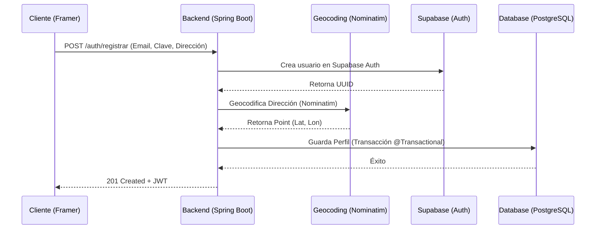

# 🎓 Presentación Examen Final: CHAMBA (Marketplace de Servicios)

## 🗣️ Introducción (El "Elevator Pitch")
**Lo que van a decir:**  
> "Hola profesor/a. Hoy presentamos **CHAMBA**, nuestro marketplace de servicios. Nuestro enfoque no fue solo hacer que 'funcione', sino construir un backend con calidad de producción, escalable y seguro. Vamos a mostrarles cómo cumplimos con las operaciones CRUD, cómo estructuramos la API REST y las decisiones técnicas que tomamos para lograrlo."

---

## 🛠️ Bloque 0: Stack Tecnológico y Librerías (El Motor del Proyecto)

Para construir una plataforma de nivel profesional, seleccionamos un conjunto de herramientas modernas que garantizan escalabilidad, seguridad y una experiencia de usuario fluida.

### 🍃 Backend (Spring Boot & Ecosistema Java)
Elegimos **Spring Boot 3.4.4** como núcleo por su madurez y capacidad de inyectar dependencias de forma robusta. Estas son las librerías clave que utilizamos:

*   **Spring Security:** Fundamental para blindar la API. La elegimos porque nos permite manejar la seguridad de forma centralizada y gestionar los tokens JWT que vienen de Supabase.
*   **Hibernate Spatial (JTS):** Es la pieza que nos permite hablar con **PostGIS**. La elegimos para poder guardar y consultar puntos geográficos (`Point`) directamente desde Java sin romper la Arquitectura Limpia.
*   **Hypersistence Utils:** Una extensión avanzada de Hibernate. La elegimos específicamente para poder manejar el tipo de dato **JSONB** de PostgreSQL (usado en nuestras redes sociales dinámicas).
*   **Cloudinary SDK:** Para la gestión de archivos. Elegimos **Cloudinary** porque guardar fotos en la base de datos es una mala práctica de rendimiento; esta librería nos permite subir imágenes a la nube y obtener URLs optimizadas con CDN.
*   **SpringDoc OpenAPI (Swagger):** La elegimos para cumplir con el requisito de documentar nuestra API. Genera automáticamente una interfaz interactiva para testear todos los endpoints.
*   **Spring Mail:** Integrada para la comunicación por SMTP con Gmail. La elegimos para automatizar los mails de confirmación y recuperación de contraseña.
*   **Lombok:** Para la eficiencia del desarrollador. Nos permite mantener nuestras clases limpias de código repetitivo (Getters, Setters, Builders) mediante anotaciones.

### 🎨 Frontend (React & Framer Ecosystem)
Nuestro frontend se destaca por su estética premium y animaciones fluidas, logradas gracias a estas librerías:

*   **React:** La base de todos nuestros componentes. Elegida por su manejo eficiente del estado y su arquitectura basada en componentes reutilizables.
*   **Framer Motion:** Es el alma visual de Chamba. La elegimos para crear esas micro-animaciones (hovers, transiciones suaves, entradas dinámicas) que dan la sensación de una app de alta fidelidad.
*   **Supabase SDK:** El puente con el servicio de Auth. Lo elegimos por su facilidad para gestionar sesiones de usuario, tokens de acceso y la integración nativa con el sistema de confirmación por email.
*   **Pigeon Maps:** Para la visualización del mapa. La elegimos porque es extremadamente ligera comparada con Google Maps y se integra perfectamente con el entorno de Framer, permitiéndonos total control sobre el diseño de los marcadores.
*   **SweetAlert2 (Swal):** Para las alertas del sistema. En lugar de usar los diálogos feos del navegador, esta librería nos da ventanas emergentes modernas y personalizables que mejoran el UX.
*   **Lucide React:** Nuestra librería de iconografía. Elegida por tener un catálogo moderno de iconos SVG que son totalmente personalizables en color y tamaño desde el código.

---

## 🧱 Bloque 1: Arquitectura Limpia (Cómo organizamos la casa)
**El concepto:** Explicar que no metieron todo el código en una sola carpeta, sino que usaron **Clean Architecture** (Arquitectura Hexagonal). Esto permite que el sistema sea fácil de mantener, testear y escalar.

### 📂 Nuestra Estructura de Carpetas
"Dividimos el proyecto en capas bien definidas para separar las responsabilidades técnicas de las reglas de negocio:"

1.  **`domain` (EL NÚCLEO):**
    *   Es la capa más importante y **pura**. No depende de ningún framework (ni Spring, ni JPA).
    *   **`model`:** Contiene nuestras entidades de negocio (POJOs) como `Proveedor` o `Servicio`.
    *   **`repository`:** Define las **interfaces** (puertos) de cómo queremos que se guarden los datos, sin decir qué base de datos usamos.
2.  **`application` (CASOS DE USO):**
    *   Es el director de orquesta. Aquí vive la lógica de "qué debe pasar".
    *   **`usecase`:** Interfaces que definen las acciones del sistema (ej: `IRegistrarProveedor`).
    *   **`service`:** Implementaciones que coordinan el flujo: llaman al dominio, validan y persisten.
    *   **`dto`:** Objetos de transferencia para que el cliente no vea nuestras entidades internas (separados en `request` y `response`).
3.  **`infrastructure` (ADAPTADORES):**
    *   Es la capa técnica que habla con el mundo exterior.
    *   **`adapter/in/web`:** Aquí están nuestros **Controllers**. Reciben el HTTP y lo pasan a la capa de aplicación.
    *   **`adapter/out/persistence`:** Aquí vive la base de datos real (JPA, Entidades de tabla, Repositorios de Spring Data).
    *   **`adapter/out/api`:** Clientes para servicios externos como **Supabase** (Auth) o **Cloudinary** (Fotos).
4.  **`common`:**
    *   Utilidades transversales y herramientas que usamos en todo el proyecto (como mapeadores o constantes globales).

> **Punto clave para destacar:** "Si mañana decidimos cambiar la base de datos de PostgreSQL a MongoDB, solo tenemos que tocar la carpeta `infrastructure`. El corazón del negocio (`domain`) y cómo funcionan los procesos (`application`) se mantienen intactos."

---

## 🔄 Bloque 2: La API REST y el CRUD (Ejemplos Reales)
**El concepto:** Demostrar que tenemos una API madura que sigue los estándares de la industria. Usamos como ejemplo el **Catálogo de Rubros**, que es nuestro "Maestro" de categorías.

### 🆕 C (Create): Registro de un nuevo Rubro
Para crear recursos, usamos `@PostMapping`. Lo importante aquí es la semántica: devolvemos un estado **201 Created**.

```java
@PostMapping
public ResponseEntity<Rubro> crear(@Valid @RequestBody Rubro rubro) {
    // Recibimos el objeto, lo validamos y lo guardamos
    return ResponseEntity.status(HttpStatus.CREATED).body(rubroRepository.save(rubro));
}
```

### 🔍 R (Read): Listado para el Frontend
Para las consultas usamos `@GetMapping`. Este endpoint alimenta los selectores (dropdowns) de nuestra aplicación:

```java
@GetMapping
public ResponseEntity<List<RubroDto>> listar() {
    // Consultamos la base de datos y devolvemos la lista convertida a DTO
    return ResponseEntity.ok(rubroService.listarActivos());
}
```

### 🆙 U (Update): Edición de Categorías
Para las actualizaciones completas usamos `@PutMapping`. El uso de este método garantiza la **idempotencia** (si la mandas 10 veces, el resultado es el mismo).

```java
@PutMapping("/{id}")
public ResponseEntity<Rubro> actualizar(@PathVariable Long id, @RequestBody Rubro dto) {
    // Buscamos por ID y actualizamos los campos necesarios
    return ResponseEntity.ok(rubroService.actualizar(id, dto));
}
```

### 🗑️ D (Delete): Borrado Lógico (Soft Delete)
En un sistema profesional, **nunca borramos datos físicos**. Usamos un borrado lógico para mantener la integridad referencial y las estadísticas históricas:

```java
@DeleteMapping("/{id}")
public ResponseEntity<Void> eliminar(@PathVariable Long id) {
    // Simplemente cambiamos un flag: activa = false
    rubroService.desactivar(id);
    return ResponseEntity.noContent().build(); // 204 No Content
}
```

**Resumen para la defensa:** "Usamos los verbos HTTP correctamente según su propósito, manejamos códigos de estado precisos (201, 200, 204) y aplicamos borrado lógico para proteger la integridad de la base de datos."

---

---

## 🛡️ Bloque 3: Seguridad y DTOs (Por qué no exponemos la base de datos)
**El concepto:** Explicar el uso de Data Transfer Objects.

**Cómo explicarlo fácil:**  
"Nuestras Entidades de base de datos nunca llegan al cliente. Usamos **DTOs** por tres motivos:
1.  **Seguridad:** No filtramos contraseñas ni IDs ocultos.
2.  **Rendimiento:** Evitamos errores de recursividad al transformar a JSON.
3.  **Contrato Estable:** Mantenemos un contrato fijo con el frontend independientemente de cómo cambie la DB."

> **Dato extra:** "Incluso separamos los DTOs en `request` (donde aplicamos las validaciones `@Valid`) y `response` (lo que sale limpio hacia el cliente)."

---

## 🔐 Bloque 4: Autenticación, Email y Seguridad (Supabase + Gmail)

Para el manejo de usuarios, no reinventamos la rueda: delegamos la seguridad en **Supabase Auth** pero mantenemos el control de los datos en nuestra DB local. 

### 1. Sincronización de Estados (Email Confirmado)
El problema técnico era: *¿Cómo saber en nuestra base de datos si el usuario confirmó su mail en Supabase?* 
Lo resolvimos con un sistema de **Sincronización en el Login**:

```java
// AuthServiceImpl.java (Sincronización)
public AuthRespuestaDto login(LoginSolicitudDto dto) {
    // 1. Autenticar en Supabase
    Map<String, String> resp = supabaseAuthPort.login(dto.getEmail(), dto.getPassword());
    
    // 2. Si el login es exitoso, preguntamos si el email ya está confirmado en el token
    if (!usuarioLocal.isEmailConfirmado()) {
        boolean confirmado = supabaseAuthPort.estaEmailConfirmado(resp.get("access_token"));
        if (confirmado) {
            usuarioLocal.setEmailConfirmado(true);
            usuarioRepository.save(usuarioLocal); // Sincronizamos
        }
    }
}
```

### 2. Flujo de Recuperación de Contraseña
Implementamos un flujo de recuperación de 3 pasos:
1.  **Solicitud:** El usuario pide recuperar -> Backend le dice a Supabase -> Supabase envía un mail con un **Token**.
2.  **Detección (Frontend):** Al hacer clic en el mail, el frontend detecta el token en la URL y muestra el formulario de "Nueva Contraseña".
3.  **Persistencia:** El backend recibe el token y la nueva clave, validando la seguridad:

```java
// AuthController.java
@PostMapping("/actualizar-password")
public ResponseEntity<Void> actualizarPassword(
        @RequestHeader("Authorization") String token, 
        @RequestParam String nuevaPassword) {
    
    // Validación de seguridad robusta (Regex) antes de llamar al servicio
    validarFortaleza(nuevaPassword); 
    authUseCase.cambiarPassword(nuevaPassword, token.replace("Bearer ", ""));
    return ResponseEntity.ok().build();
}
```

### 3. Configuración de Gmail SMTP
Para garantizar que los correos lleguen (evitando bloqueos), configuramos **Gmail** con contraseñas de aplicación:
*   **Protocolo:** SMTP (Puerto 587 con STARTTLS).
*   **Plantillas:** Diseñamos HTML personalizado en el panel de Supabase para mantener la identidad visual de "Chamba".

---

## 📍 Bloque 5: Geolocalización y Mapas (PostGIS)

Uno de los mayores retos técnicos fue convertir una dirección física (texto) en un punto interactivo en un mapa con búsquedas por radio de cercanía. Así es como lo logramos:

### 1. Captura y Procesamiento (Frontend -> Backend)
El usuario ingresa su dirección en el formulario. Estos datos viajan al backend como un DTO estructurado, donde un `GeocodingService` se comunica con la API de **Nominatim (OpenStreetMap)** para transformar ese texto en coordenadas (Latitud y Longitud):

```java
// GeocodingService.java (Simplificado)
public double[] obtenerCoordenadas(String direccion) {
    // Ejemplo: "Av. General Paz 1234, Mar del Plata, Argentina" -> Nominatim API
    List<Map<String, Object>> resultados = restClient.get()
            .uri(uriBuilder -> uriBuilder.path("/search").queryParam("q", direccion).queryParam("format", "json").build())
            .retrieve()
            .body(new ParameterizedTypeReference<List<Map<String, Object>>>() {});

    // Retorna un array [Longitud, Latitud]
    return new double[]{lon, lat};
}
```

### 2. Persistencia Espacial (PostGIS)
En lugar de guardar Lat/Lon como números planos, usamos la extensión **PostGIS**. En Java, mapeamos esto con la librería **JTS (Java Topology Suite)** usando el tipo `Point`:

```java
@Entity
public class PerfilProveedor {
    // Definimos la columna como tipo geográfico con SRID 4326 (WGS84)
    @Column(columnDefinition = "geography(Point, 4326)")
    private Point ubicacion; 
}
```

### 3. Búsqueda por Proximidad (Query Espacial)
Para encontrar profesionales "cerca de mí", delegamos la potencia a PostgreSQL usando la función `ST_DWithin`, que es extremadamente rápida gracias a los índices GIST:

```sql
-- Query Real en PerfilProveedorRepository
@Query(value = "SELECT p.id FROM perfiles_proveedor p " +
               "WHERE ST_DWithin(p.ubicacion, ST_SetSRID(ST_Point(:lon, :lat), 4326), :radioMetros) = true " +
               "ORDER BY ST_Distance(p.ubicacion, ST_SetSRID(ST_Point(:lon, :lat), 4326)) ASC", 
       nativeQuery = true)
List<UUID> buscarCercanos(@Param("lat") double lat, @Param("lon") double lon, @Param("radioMetros") double radioMetros);
```

### 💡 ¿Por qué PostGIS y no un cálculo matemático manual?
Esta es una pregunta clásica de examen. Aquí la explicación fácil:

**1. El método "Lento" (Pitágoras Manual):**
Si guardáramos Latitud y Longitud como números normales (Float), para buscar tendríamos que aplicar la fórmula de la distancia a **cada fila** de la base de datos:
$$\sqrt{(x_2-x_1)^2 + (y_2-y_1)^2} < \text{radio}$$
Si tenemos 1.000.000 de profesionales, la DB tiene que hacer 1.000.000 de raíces cuadradas en cada búsqueda. Esto colapsaría el servidor.

**2. El método PostGIS (Índice GIST / R-Tree):**
PostGIS usa **Índices Espaciales**. Imagina que el mapa está dividido en una cuadrícula de rectángulos (**Bounding Boxes**). 
*   **Paso A:** PostGIS descarta instantáneamente todos los puntos que no están en los rectángulos que toca tu círculo de búsqueda. (Descarta el 99% de los datos sin calcular nada).
*   **Paso B:** Solo calcula la distancia exacta para el 1% restante.
*   **Resultado:** La búsqueda pasa de tardar segundos a **milisegundos**.

**Ventajas clave:**
*   **Curvatura Terrestre:** PostGIS sabe que la Tierra es un esferoide, no un plano. El cálculo manual falla en distancias largas.
*   **Escalabilidad:** Está diseñado para manejar millones de puntos con un impacto mínimo en memoria.
*   **Funciones Avanzadas:** ST_DWithin no solo mide distancia, usa el índice espacial para optimizar la consulta.

---

---

## 🧪 Bloque 6: Swagger y Pruebas (API 100% Documentada)
**El concepto:** Mostrar que el sistema es "Transparente" y profesional mediante **Swagger UI (OpenAPI 3)**.

**Cómo explicarlo fácil:**  
"Cualquier evaluador puede explorar los contratos de nuestra API sin leer una sola línea de código. Integramos Swagger para que la documentación sea interactiva y siempre esté actualizada."

### ¿Qué logramos con esto?
1.  **Interactividad:** Podemos probar los endpoints (incluso los protegidos con JWT) directamente desde el navegador.
2.  **Contratos Claros:** Los parámetros de entrada, salida y esquemas de los DTOs son visibles y están tipados.
3.  **Códigos de Estado:** Documentamos qué significa un 200, 201, 400 o 404 para cada ruta.

**Ejemplo de cómo documentamos un Controlador:**

```java
@Tag(name = "Rubros", description = "Catálogo Maestro")
@RestController
@RequestMapping("/rubros")
public class RubroController {

    @Operation(summary = "Listar rubros activos", 
               description = "Retorna las categorías para los selectores del frontend.")
    @ApiResponse(responseCode = "200", description = "Lista obtenida con éxito")
    @GetMapping
    public ResponseEntity<List<RubroDto>> listar() {
        return ResponseEntity.ok(rubroService.listarActivos());
    }
}
```

---

## 🔄 Bloque 7: Ciclo de Vida de una Petición (El camino del Dato)
**El concepto:** Explicar cómo viaja la información desde que el usuario hace clic en el frontend hasta que se guarda en la nube y en nuestra base de datos.

Este diagrama de secuencia muestra el flujo de un **Registro de Proveedor**, que involucra servicios externos en una sola transacción:


```mermaid
sequenceDiagram
    participant C as Cliente (Framer)
    participant API as Backend (Spring Boot)
    participant MP as Geocoding (Nominatim)
    participant S as Supabase (Auth)
    participant DB as Database (PostgreSQL)

    C->>API: POST /auth/registrar (Email, Clave, Dirección)
    API->>S: Crea usuario en Supabase Auth
    S-->>API: Retorna UUID
    API->>MP: Geocodifica Dirección (Nominatim)
    MP-->>API: Retorna Point (Lat, Lon)
    API->>DB: Guarda Perfil (Transacción @Transactional)
    DB-->>API: Éxito
    API-->>C: 201 Created + JWT
```

---

## 🧠 Bloque 8: Decisiones Arquitectónicas (El "Por Qué")
*Este bloque demuestra que pensaron como verdaderos ingenieros de software.*

1.  **Sincronización Dual con Supabase:**  
    *   **Por qué:** En lugar de guardar contraseñas (riesgo de seguridad), delegamos la autenticación a Supabase. Guardamos el UUID localmente para mantener la integridad de los perfiles.
2.  **Columnas JSONB en PostgreSQL:**  
    *   **Por qué:** Para datos variables (redes sociales o especialidades), usamos esquemas **JSONB**. Nos da la flexibilidad de NoSQL con la robustez de SQL.
3.  **Carga de Archivos vs. Enlaces:**  
    *   **Por qué:** Las fotos se suben a **Cloudinary (CDN)** porque guardar imágenes en la DB arruina el rendimiento. Para videos, usamos enlaces externos para ahorrar costos y mejorar el **SEO**.
4.  **Slugs vs. UUIDs para el Frontend:**  
    *   **Por qué:** Reemplazamos URLs con IDs largos por **Slugs** (ej. `/proveedor/kevin-yanez-programador`). Esto hace que los perfiles sean compartibles y posicionen mejor en Google.
5.  **Transacciones Atómicas:**  
    *   **Por qué:** El registro está anotado con `@Transactional`. Es una operación "todo o nada", evitando dejar cuentas a medio crear si algo falla.

---

## 📧 Bloque 9: Gestión de Emails y Notificaciones (Gmail SMTP)

Para un sistema de marketplace, la comunicación por email es crítica (Confirmación de registro y Recuperación de contraseña). Implementamos un motor de correos robusto para garantizar la identidad y seguridad de los usuarios.

### 1. El Problema Técnico: Bloqueo de Puertos
Muchos proveedores de nube (como Render) bloquean por defecto los puertos SMTP tradicionales (25 y 465) para evitar el spam.
**Solución:** Integramos **Gmail SMTP** configurado con **Contraseñas de Aplicación** y usamos el puerto **587 (STARTTLS)**. Esto nos permite enviar correos transaccionales de forma segura y profesional.

### 2. Orquestación de Recuperación de Clave
El proceso involucra tanto al backend como al frontend en una danza sincronizada:
1.  **Backend:** Valida que el email existe y dispara la solicitud a Supabase Auth.
2.  **Email:** Supabase genera un token de seguridad único y envía el correo con una plantilla HTML personalizada.
3.  **Frontend:** Detecta el token en la URL y transforma la interfaz de login en una interfaz de "Nueva Contraseña" con validaciones de fuerza.

```java
// AuthController.java - Endpoint de actualización
@PostMapping("/actualizar-password")
public ResponseEntity<Void> actualizarPassword(
        @RequestHeader("Authorization") String token, 
        @RequestParam String nuevaPassword) {
    
    // El token llega desde el Frontend tras validar el clic en el email
    authUseCase.cambiarPassword(nuevaPassword, token.replace("Bearer ", ""));
    return ResponseEntity.ok().build();
}
```

### 3. Experiencia de Usuario (Branding)
No enviamos texto plano. Diseñamos plantillas HTML responsivas que incluyen:
*   **Colores de Marca:** Uso de `#A01EED` (Violeta Chamba) para botones de acción.
*   **Botones Dinámicos:** El link `{{ .ConfirmationURL }}` redirige al usuario de vuelta a nuestra app con el token inyectado.

**Justificación técnica:** "Elegimos este esquema híbrido (Backend Spring + Auth Supabase + SMTP Gmail) para no comprometer la seguridad de las credenciales de los usuarios y asegurar que los correos nunca terminen en la carpeta de SPAM."

---

## 🖼️ Bloque 10: Gestión Multimedia (Cloudinary CDN)

Para manejar las fotos de perfil y portfolios, no guardamos los archivos en nuestra base de datos. Implementamos una integración con **Cloudinary**.

### 1. El Problema: Base de Datos Pesada
Guardar imágenes (BLOBs) en una base de datos relacional degrada el rendimiento y encarece el almacenamiento. Además, servir imágenes desde el servidor de aplicaciones consume ancho de banda innecesario.

### 2. La Solución: Content Delivery Network (CDN)
Delegamos el almacenamiento y la optimización a **Cloudinary**:
*   **Subida:** El backend recibe el archivo y lo envía al SDK de Cloudinary.
*   **Persistencia:** En nuestra base de datos local **solo guardamos la URL segura** (`https://res.cloudinary.com/...`).
*   **Optimización:** Cloudinary nos permite aplicar transformaciones (redimensionado, recorte facial automático) directamente desde la URL.

### 3. Configuración Técnica (Bean de Cloudinary)
Usamos una configuración desacoplada para no exponer credenciales:

```java
@Configuration
public class CloudinaryConfig {
    @Bean
    public Cloudinary cloudinary() {
        Map<String, String> config = new HashMap<>();
        config.put("cloud_name", cloudName);
        config.put("api_key", apiKey);
        config.put("api_secret", apiSecret);
        return new Cloudinary(config);
    }
}
```

**Justificación técnica:** "Elegimos Cloudinary porque nos permite ofrecer una carga de imágenes ultra rápida mediante su red de CDN global, liberando a nuestro servidor de Spring Boot de la carga de procesar y servir archivos estáticos."

---

## 🏗️ Bloque 11: Patrones de Diseño (Soluciones Estándar)
*En lugar de inventar la rueda, usamos moldes probados para resolver problemas comunes.*

### 1. Factory Pattern (El "Cocinero Especializado")
**Explicación fácil:** Imagina un restaurante. El mozo (nuestro Servicio de Auth) recibe un pedido. Si el pedido es "Proveedor", llama al cocinero de proveedores; si es "Empresa", llama al de empresas. El mozo no sabe cocinar, solo sabe a quién llamar.

**Ejemplo en el código:**
```java
// Interfaz que deben cumplir todos los "cocineros"
public interface IPerfilFactory {
    void crearYGuardarPerfil(Usuario usuario, ...);
    String getTipo(); // Retorna "PROVEEDOR" o "EMPRESA"
}

// Implementación específica
@Component
public class PerfilProveedorFactory implements IPerfilFactory {
    public void crearYGuardarPerfil(...) {
        // Lógica específica para crear un proveedor
    }
}
```

### 2. Adapter Pattern (El "Enchufe Universal")
**Explicación fácil:** Nuestra aplicación tiene un enchufe europeo, pero Supabase es un tomacorriente americano. El **Adaptador** es el aparato que conectamos en el medio para que ambos funcionen sin tener que cambiar los cables de nuestra casa.

**Ejemplo en el código:**
```java
// Nuestra interfaz (Lo que nuestra app entiende)
public interface ISupabaseAuthPort {
    UUID registrar(String email, String password);
}

// El adaptador (Traduce nuestras órdenes a la API de Supabase)
@Component
public class SupabaseAuthAdapter implements ISupabaseAuthPort {
    public UUID registrar(...) {
        // Lógica interna que llama a la URL de Supabase
    }
}
```

### 3. Builder Pattern (El "Armado de Hamburguesa")
**Explicación fácil:** En lugar de un constructor gigante donde te podés confundir el orden de los datos, el Builder te permite armar el objeto paso a paso: *"Ponele queso, ponele panceta, ahora armalo"*.

```java
// Mucho más legible que un constructor con 10 parámetros
Usuario user = Usuario.builder()
    .nombre("Mariano")
    .email("mariano@ejemplo.com")
    .telefono("123456")
    .build();
```

---

## 💎 Bloque 12: Principios SOLID (Código de Alta Calidad)
*Son 5 reglas de oro para que el código sea fácil de leer y difícil de romper.*

### 1. SRP: Responsabilidad Única (Un empleado, una tarea)
**Explicación fácil:** Un empleado que hace de contador, recepcionista y limpieza, termina haciendo todo mal. En el código, cada clase hace **una sola cosa**.
*   **Ejemplo real:** `GeocodingService` solo sabe transformar direcciones en coordenadas. No sabe nada de base de datos ni de seguridad. Si falla la geolocalización, solo tocamos esta clase.

### 2. OCP: Abierto/Cerrado (Módulo de expansión)
**Explicación fácil:** El código debe ser como una consola de videojuegos: puedes ponerle juegos nuevos (extenderlo) sin tener que abrir la consola y soldar circuitos (modificar el código original).
*   **Ejemplo real:** Gracias a las **Factories**, si queremos agregar un nuevo rol "Institución", creamos una nueva clase `PerfilInstitucionFactory` y el sistema la toma sola. **No tocamos ni una línea de `AuthServiceImpl`**.

### 3. DIP: Inversión de Dependencias (No dependas de la marca, dependé del tamaño)
**Explicación fácil:** Tu control remoto no depende de la marca "Duracell", depende de que la pila sea tamaño "AA". Así, podés cambiar la marca de la pila sin comprar un control remoto nuevo.
*   **Ejemplo real:** Nuestros servicios dependen de **Interfaces**, no de clases concretas.

```java
// MAL: Acoplado a una marca/clase específica
private final SupabaseAuthAdapter auth = new SupabaseAuthAdapter();

// BIEN (DIP): Dependemos de la abstracción (el tamaño de la pila)
private final ISupabaseAuthPort authPort; 
```

**Resumen para la defensa:** "Aplicamos estos patrones y principios para que el sistema sea **escalable**. Si mañana el negocio crece o cambiamos de tecnología, el impacto en el código será mínimo porque todo está desacoplado y organizado."

---


    