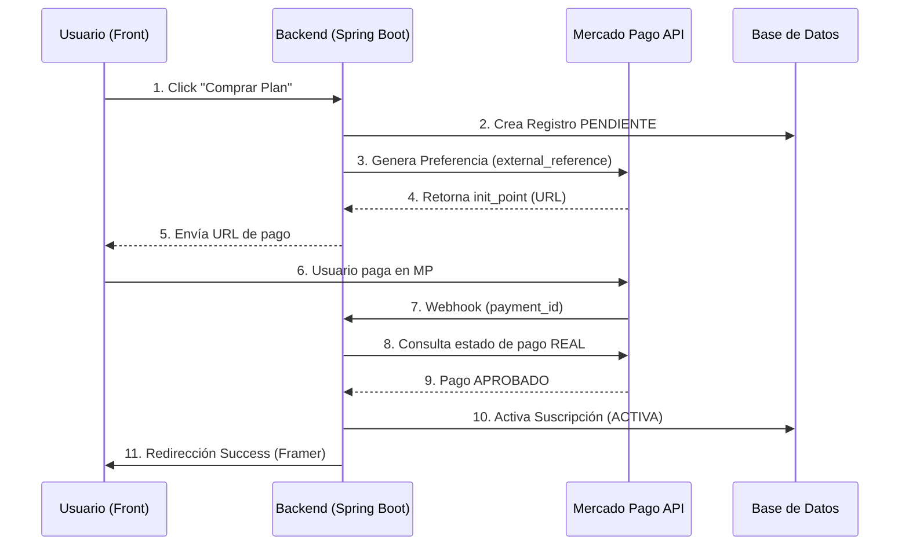

# 🛠️ Guía de Referencia: Integración Mercado Pago (Checkout Pro)

Esta documentación sirve como base técnica para cualquier compañero que necesite integrar cobros en sus proyectos usando **Mercado Pago**. Está basada en la implementación del proyecto PPS.

---

## 1. Conceptos Fundamentales
Nuestra implementación utiliza **Checkout Pro**. Es importante notar que:
*   **No es Débito Automático:** El usuario debe realizar la acción de pago cada mes. Esto reduce la fricción legal y técnica de manejar suscripciones recurrentes complejas.
*   **Seguridad:** Toda la interfaz de pago y validación de tarjetas ocurre en los servidores de Mercado Pago. Nosotros solo recibimos el resultado.

---

## 2. Requisitos Previos (¿Qué necesitas?)

Para que esto funcione en tu código, debes tener:
1.  **Access Token:** Se obtiene desde el [Dashboard de Desarrolladores](https://www.mercadopago.com.ar/developers/panel) de Mercado Pago.
2.  **URL Pública:** Mercado Pago necesita una URL real (HTTPS) para enviarte los Webhooks. Si estás en local, usa **Ngrok**.
3.  **Variables de Entorno:** Configura tu `application.yml` o `.env` de la siguiente manera:

```yaml
mercadopago:
  access-token: "TU_ACCESS_TOKEN_AQUÍ"
  backend-base-url: "https://tu-api-desplegada.com"
  frontend-url: "https://tu-app-framer-o-react.com"
```

---

## 3. Arquitectura del Flujo (Paso a Paso)



### A. Generación de la Preferencia
No enviamos al usuario a un link estático. Generamos un **link dinámico** que contiene la información de la compra.

**Lógica Clave:**
*   **`external_reference`:** Este es el campo más importante. Aquí guardamos el ID de nuestra base de datos (ej. ID de la factura o de la suscripción) para saber quién pagó cuando llegue el aviso.

```java
// Ejemplo conceptual de creación de preferencia
Map<String, Object> preference = new HashMap<>();
preference.put("items", List.of(item));
preference.put("external_reference", "ID_INTERNO_DE_TU_BD");
preference.put("back_urls", backUrls);
```

### B. El Webhook (El Corazón de la Verdad)
Nunca confíes en el retorno del frontend (`success_url`). La única forma segura de confirmar un pago es el **Webhook**.

1.  Mercado Pago envía un `POST` a tu endpoint `/webhook`.
2.  Tu backend recibe un `payment_id`.
3.  **IMPORTANTE:** Tu backend debe llamar a la API de Mercado Pago con ese ID para verificar que el estado sea realmente `approved`.

---
tip

## 5. Tips para tus Proyectos

> [!TIP]
> **Uso de external_reference:** Siempre usa UUIDs o IDs únicos de tu base de datos en este campo. Es el único puente entre el mundo de Mercado Pago y tu sistema.

> [!IMPORTANT]
> **Validación de Montos:** Al recibir el Webhook, verifica que el monto pagado (`transaction_amount`) coincida con lo que esperabas cobrar en tu base de datos para evitar hackeos de precios.

### Estados de Pago a Manejar:
- `approved`: El dinero ya está en tu cuenta. Activa el servicio.
- `pending`: El usuario eligió Rapipago/Pagofácil. No actives nada hasta que cambie a `approved`.
- `rejected`: Pago fallido. Informar al usuario.

---

## 6. Testing (Modo Sandbox)
Mientras desarrollas, usa las **Credenciales de Prueba** y las [Tarjetas de Prueba](https://www.mercadopago.com.ar/developers/es/docs/checkout-pro/additional-content/test-cards). Esto te permite simular pagos aprobados y rechazados sin mover dinero real.

---


