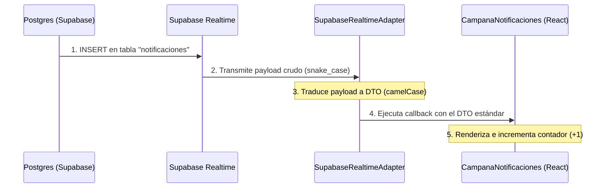

# GUÍA TÉCNICA Y DIDÁCTICA: Notificaciones en Tiempo Real y Patrón Adapter (Sprint 6)

## 1. El Problema: El costo del Polling y la falta de Inmediatez
En versiones anteriores de **CHAMBA**, las notificaciones del usuario se cargaban haciendo llamadas periódicas HTTP a la API cada 30 segundos (técnica conocida como *polling*).
*   **Problema de Servidor:** Cientos de clientes conectados llamando cada 30 segundos genera una sobrecarga enorme de requests redundantes en la base de datos y en el backend.
*   **Problema de UX:** El usuario tiene que esperar hasta medio minuto para enterarse de que el estado de su postulación cambió, restándole inmediatez y dinamismo a la plataforma.

---

## 2. La Solución: Tiempo Real Desacoplado (WebSockets + Patrón Adapter)
Para solucionar esto, introdujimos la tecnología de **WebSockets** (comunicación push bidireccional continua).

Sin embargo, como ingenieros de software, sabíamos que podíamos implementar esto de dos formas: usando el motor serverless de **Supabase Realtime** (Plan A) o el servidor nativo de **Spring Boot STOMP** (Plan B). Para evitar quedar atados a un proveedor específico y poder cambiar de motor de red en el futuro sin romper el diseño visual del Navbar o la Campana, implementamos el **Patrón de Diseño Adapter** combinándolo con una **Fábrica Simple**.

---

## 3. ¿Cómo funciona el Patrón Adapter en nuestro Frontend?

El patrón **Adapter** convierte la interfaz de una clase en otra interfaz que el cliente espera. Permite que clases con interfaces incompatibles trabajen juntas.

En nuestro caso:
*   **El Cliente (La Campana):** Espera recibir siempre un objeto de tipo Notificación con la estructura limpia en `camelCase` (ej. `tipoNotificacion`, `fechaCreacion`).
*   **Supabase Realtime:** Envía datos crudos de la base de datos en `snake_case` (ej. `tipo_notificacion`, `created_at`).
*   **Spring Boot WebSockets:** Envía DTOs ya serializados por Java.

El adaptador se interpone en el medio, traduce y estandariza el flujo:



---

## 4. Estructura y Componentes del Diseño

Todo el diseño se unificó de forma autocontenida dentro del archivo del componente para garantizar la compatibilidad directa y "Plug & Play" con el editor de **Framer**:

### A. La Interfaz Conceptual (`IRealtimeAdapter`)
Es la clase abstracta que define las reglas del juego. Cualquier motor de tiempo real que queramos agregar en el futuro está obligado a implementar estos dos métodos:
```javascript
class IRealtimeAdapter {
    connect(userId, onNotificationReceived) {}
    disconnect() {}
}
```

### B. El Adaptador de Supabase (`SupabaseRealtimeAdapter`)
Es la implementación activa actual. Se conecta al canal de Supabase, escucha eventos `INSERT` en la tabla `notificaciones` filtrando por el ID del usuario actual, y traduce los nombres de campos de base de datos a camelCase antes de entregárselo a la campana.

### C. El Adaptador de Spring Boot (`SpringBootRealtimeAdapter`)
Es el adaptador de contingencia. Si el día de mañana deseamos independizarnos de Supabase, este adaptador se conectará a la ruta de WebSockets `/ws` del backend usando el protocolo **STOMP** y se suscribirá al canal `/user/{userId}/queue/notifications`.

### D. La Fábrica y Hook de Conexión (`useRealtimeNotifications`)
Es un custom hook que actúa como **Fábrica Simple (Simple Factory)**. Define qué adaptador se inicializa basándose en la constante:
```javascript
const PROVIDER_TYPE = 'SUPABASE'; // 'SUPABASE' o 'SPRING_BOOT'
```
El componente visual de la campana solo invoca a este hook:
```javascript
useRealtimeNotifications(userId, apiUrl, handleNuevaNotificacion);
```
La campana no sabe (ni le importa) de dónde vienen los datos; solo sabe que cuando llega una notificación a través de la interfaz unificada, la debe renderizar.

---

## 5. Resumen del Flujo de Datos Completo (Didáctico)

1.  **Cambio en Backend:** El backend detecta un cambio de estado en una postulación (ej. de `ENVIADO` a `VISTO`) y ejecuta `notificacionRepository.save()`.
2.  **Disparo de Base de Datos:** Se inserta el registro en la tabla `notificaciones` en PostgreSQL de Supabase.
3.  **Captura Realtime:** El motor de replicación de Supabase (habilitado mediante `ALTER PUBLICATION`) lee el registro insertado.
4.  **Emisión WebSocket:** Supabase publica la inserción a todos los WebSockets conectados que cumplan con la regla de filtrado (`usuario_id = UUID_del_usuario`).
5.  **Recepción y Traducción:** El navegador del usuario recibe el paquete. La clase `SupabaseRealtimeAdapter` intercepta la señal, toma los datos, los convierte en el DTO esperado por React y ejecuta el callback `onNotificationReceived`.
6.  **Actualización de UI:** El hook dispara el callback de estado en la Campana. React detecta el nuevo elemento, incrementa el contador de no leídas (`unreadCount`) y muestra la alerta en el popover con una micro-animación fluida de Framer Motion.
